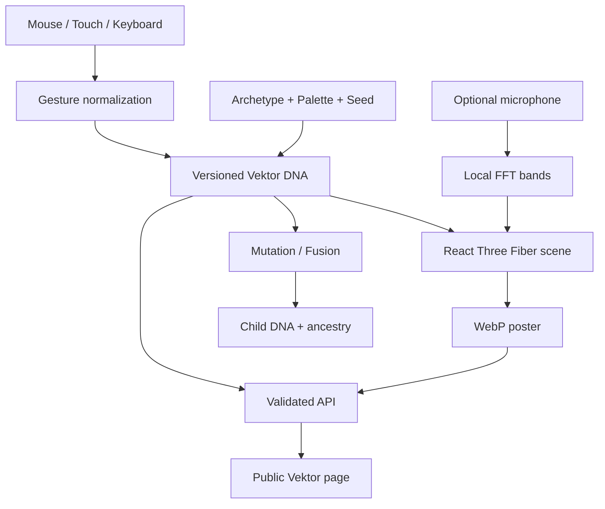

# Vektorix nasıl çalışır?

## Kısa tanım

Vektorix, kullanıcının hareketlerinden “Vektor” adı verilen yaşayan görünümlü dijital organizmalar ürettiği interaktif bir 3D laboratuvardır.

Kullanıcı bir metin veya yapay zekâ prompt’u yazmaz. Organizma; mouse, trackpad, dokunma, klavye, seçilen enerji karakteri, renk paleti ve isteğe bağlı mikrofon verisinden şekillenir.

Sistemin temel cümlesi şudur:

> Create life from motion, sound and energy.

Vektorix bir oyun, klasik 3D model düzenleyici veya rastgele parçacık gösterisi değildir. Temel ürün fikri, kullanıcının fiziksel hareketini tekrar üretilebilir bir dijital canlı karakterine dönüştürmektir.

## Vektorix ne değildir?

Vektorix’in nasıl çalıştığını anlamanın en kolay yollarından biri, ne olmadığını bilmektir:

- Yapay zekâ veya LLM kullanmaz.
- Metinden görsel ya da 3D model üretmez.
- Kullanıcıdan prompt istemez.
- Hazır 3D modeller arasından seçim yaptırmaz.
- NFT, token, kripto para, blockchain veya wallet içermez.
- Her parçacığı ayrı bir React bileşeni olarak çizmez.
- Organizmayı yalnızca kaydedilmiş bir resim olarak saklamaz.

Üretim; matematiksel procedural generation, seeded random, shader deformasyonları, gesture analizi ve deterministic DNA sistemi ile yapılır.

## Kullanıcı deneyimi

### 1. Landing page

Kullanıcı siteyi açtığında gerçek zamanlı çalışan bir Vektor görür. Bu dekoratif bir video değildir; React Three Fiber ile çizilen canlı bir WebGL sahnesidir.

Pointer hareketi organizmanın kamera ve parçacık alanına küçük tepkiler verir. Kullanıcı buradan:

- `Enter the Lab` ile üretim alanına,
- `Explore` ile diğer Vektor’lara

gidebilir.

Lab’e geçiş sırasında sahne büyür ve kullanıcı doğrudan oluşturma deneyimine alınır.

### 2. Lab

`/lab`, ürünün ana bölümüdür. Kullanıcı burada yedi aşamadan geçer:

| Aşama     | Kullanıcının yaptığı                                          | Sistemin yaptığı                                                        |
| --------- | ------------------------------------------------------------- | ----------------------------------------------------------------------- |
| Awaken    | Pointer’ı hareket ettirir veya klavye kullanır                | Çekirdeği aktive eder ve ilk hareket örneklerini toplar                 |
| Shape     | Hareket etmeye, yön değiştirmeye ve basılı tutmaya devam eder | Hız, kıvrım, yön ve yoğunluğu özetler                                   |
| Charge    | Calm, Chaotic, Electric veya Organic seçer                    | Hareket, pulse, turbulence ve orbit davranışına karakter bias’ı uygular |
| Color     | Sekiz paletten birini seçer                                   | Shader renk uniform’larını ve arka planı günceller                      |
| Sound     | İsterse mikrofonu açar                                        | Sesi yalnızca tarayıcıda bass, mid ve treble bantlarına ayırır          |
| Stabilize | Ortaya çıkan karakteri inceler                                | DNA’dan anlaşılır karakter özellikleri çıkarır                          |
| Name      | İsim ve isteğe bağlı kısa açıklama girer                      | Vektor’u doğrular, poster üretir ve yayımlar                            |

Uzun bir onboarding ekranı yoktur. Kullanıcı birkaç saniye içinde sahneyle doğrudan etkileşime girer.

## Hareket nasıl DNA’ya dönüşüyor?

Kullanıcının pointer veya klavye hareketleri önce normalize edilmiş noktalara çevrilir. Sistem en fazla son 128 hareket noktasını geçici olarak tutar.

Her nokta şu temel bilgileri taşır:

- Normalize edilmiş X ve Y konumu
- Zaman
- Destekleniyorsa pointer pressure
- Pressure yoksa hareket hızından türetilen yoğunluk

Bu ham noktalar kalıcı olarak saklanmaz. Hareket bittiğinde noktalar kompakt bir özete dönüştürülür:

```text
Ham hareket noktaları
        ↓
Hız, kıvrım, yön ve pressure analizi
        ↓
8 yönlü gesture signature
        ↓
Normalize edilmiş gesture özeti
        ↓
Seed + archetype + palette ile Vektor DNA
```

Gesture özetinde beş ana veri bulunur:

| Veri               | Anlamı                                                   |
| ------------------ | -------------------------------------------------------- |
| `signature`        | Hareketin sekiz farklı yöne ne kadar dağıldığını anlatır |
| `averageSpeed`     | Ortalama hareket hızı                                    |
| `averageCurvature` | Hareketin ne kadar kıvrımlı ve dönüşlü olduğu            |
| `directionBias`    | Hareketin genel olarak hangi yöne aktığı                 |
| `intensity`        | Pressure veya hızdan türetilen hareket şiddeti           |

Bu değerler DNA’nın farklı alanlarını etkiler. Örneğin:

- Daha kıvrımlı hareket, symmetry ve orbit değerini yükseltir.
- Daha düz hareket, elongation değerini artırır.
- Yüksek hız, flow strength ve trail karakterini artırır.
- Sert yön değişimleri turbulence üretir.
- Yüksek pressure veya yoğunluk, pulse, glow ve density üzerinde etkili olur.

## Deterministic DNA ne demektir?

Her Vektor’un temel veri kaynağı, versioned bir DNA objesidir. DNA; görünüm, hareket ve karakter için gereken bütün kalıcı parametreleri içerir.

Ana alanlar şunlardır:

| DNA alanı   | Kontrol ettiği bölüm                                   |
| ----------- | ------------------------------------------------------ |
| `version`   | DNA formatının sürümü                                  |
| `seed`      | Seeded random sisteminin başlangıç değeri              |
| `archetype` | Calm, Chaotic, Electric veya Organic karakteri         |
| `palette`   | Ana, ikincil, vurgu ve arka plan renkleri              |
| `form`      | Symmetry, density, radius, elongation ve core ölçüleri |
| `motion`    | Speed, turbulence, pulse, orbit ve flow davranışı      |
| `surface`   | Roughness, metallic, fresnel ve glow                   |
| `particles` | Parçacık yayılımı, attraction ve repulsion             |
| `audio`     | Sesin hangi görsel alanlara ne ölçüde etki edeceği     |
| `gesture`   | Kullanıcı hareketinin kompakt özeti                    |
| `ancestry`  | Remix sonrası generation, parent ve mutation bilgisi   |

“Deterministic” olması şu anlama gelir:

> Aynı DNA, aynı görsel karakteri ve aynı hareket kurallarını yeniden kurar.

Organizma zaman içinde animasyon yaptığı için farklı saniyelerde birebir aynı ekran görüntüsünü vermek zorunda değildir. Ancak şekli, renkleri, parçacık dağılımı, hareket karakteri ve shader davranışı aynı DNA’dan tekrar üretilebilir.

Kalıcı özelliklerde `Math.random()` kullanılmaz. Seed’den üretilen kontrollü random fonksiyonu kullanılır. DNA ayrıca Zod ile doğrulanır; beklenmeyen veya sınır dışı değerler kabul edilmez.

## Archetype sistemi

Archetype, hazır bir model seçmez. Aynı procedural motorun davranışına farklı ağırlıklar verir:

| Archetype | Görsel ve hareket karakteri                                 |
| --------- | ----------------------------------------------------------- |
| Calm      | Daha yavaş, daha dengeli, güçlü orbit ve yumuşak turbulence |
| Chaotic   | Hızlı yön değişimi, yüksek turbulence ve huzursuz yüzey     |
| Electric  | Hızlı pulse, parlak parçacıklar, daha metalik yüzey         |
| Organic   | Elastik flow, nefes alan membrane ve dengeli orbit          |

Bu nedenle iki Electric Vektor birbirinin aynısı değildir. Gesture, seed ve palette farklıysa DNA ve ortaya çıkan organizma da farklı olur.

## Renk sistemi

İlk sürümde serbest color picker yerine sekiz kontrollü palet bulunur:

- Void Orchid
- Solar Flare
- Ion Blue
- Toxic Bloom
- Infrared
- Deep Ocean
- Pale Signal
- Monochrome

Palet yalnızca UI rengini değiştirmez. Shader içindeki core, parçacık, membrane, glow ve arka plan renklerini birlikte belirler. Böylece sonuç tek bir renk seçmekten daha bütünlüklü görünür.

## Mikrofon nasıl çalışıyor?

Mikrofon tamamen isteğe bağlıdır. Kullanıcı izin vermezse Lab’in tüm akışı çalışmaya devam eder.

İzin verilirse:

1. Tarayıcı `getUserMedia` ile mikrofon akışını açar.
2. Web Audio API bir `AnalyserNode` oluşturur.
3. 512 boyutlu FFT ile frekans spektrumu çıkarılır.
4. Spektrum bass, mid ve treble olarak üç banda ayrılır.
5. Bu üç sayı React state yerine canlı ref değerlerinde tutulur.
6. Shader ve sahne animasyonu bu değerleri her frame okur.

Görsel karşılıklar:

- Bass → core pulse
- Mid → yüzey deformasyonu
- Treble → parçacık ve glow yoğunluğu

Ham ses:

- Kaydedilmez.
- Sunucuya gönderilmez.
- DNA içine yazılmaz.
- Kullanıcı Lab’den çıktığında veya mikrofonu kapattığında stream durdurulur.

## 3D organizma nasıl çiziliyor?

Sahne React Three Fiber ile kuruludur. Organizma tek bir hazır 3D model değildir; birkaç procedural katmandan oluşur:

```text
LabCanvas
├── CameraRig
├── InteractionPlane
├── AudioInfluence
├── KeyboardInfluence
├── Organism
│   ├── Core
│   ├── Membrane
│   ├── ParticleField
│   └── OrbitLines
└── Post-processing
    ├── Subtle Bloom
    └── Vignette
```

### Core

Core, yüksek detaylı bir icosahedron geometry üzerinde çalışan özel vertex ve fragment shader kullanır.

Shader:

- Seed’den gelen procedural noise ile yüzeyi deforme eder.
- DNA’daki turbulence ve pulse değerlerini uygular.
- Pointer konumuna tepki verir.
- Mikrofon açıksa bass, mid ve treble değerlerini kullanır.
- Fresnel ve glow ile kenarlarda enerji hissi oluşturur.

### Membrane

Membrane, core etrafındaki düşük opacity’li enerji kabuğudur. DNA’daki shell kalınlığına ve bass değerine tepki verir.

Düşük performanslı cihazlarda bu katman tamamen kapatılır.

### Particle field

Parçacıklar tek tek React bileşeni değildir. Tek bir `BufferGeometry` içinde typed array’lerle tutulur.

Her parçacık için başlangıç konumu, faz ve ölçek bilgisi seed’den deterministik olarak üretilir. Hareketin büyük kısmı GPU üzerinde shader ile hesaplanır.

Bu yaklaşım binlerce parçacığın React render maliyeti oluşturmadan çalışmasını sağlar.

### Orbit lines

Core çevresindeki çizgiler DNA’nın orbit karakterini görünür hale getirir. Kamera serbestçe kopmaz; pointer’a çok düşük ve kontrollü bir miktarda tepki verir.

## Frame sırasında state neden güncellenmiyor?

3D sahne saniyede 30–60 kez güncellenebilir. Her frame React veya Zustand state güncellense:

- Gereksiz component render’ları oluşur.
- Garbage collection artar.
- Mobil cihazlarda frame drop yaşanır.
- Pointer ve ses tepkileri gecikir.

Bu nedenle frame sırasında değişen değerler:

- `ref`
- typed array
- buffer attribute
- stable shader uniform

üzerinden yönetilir. React ve Zustand yalnızca aşama, isim, palette, DNA veya pause gibi ürün state’leri değiştiğinde devreye girer.

## Cihaz performansına nasıl uyum sağlıyor?

Sistem cihazı yalnızca “mobile veya desktop” diye ayırmaz. Şu sinyalleri değerlendirir:

- Ekran çözünürlüğü
- Device pixel ratio
- CPU çekirdek sayısı
- Tarayıcı bildiriyorsa cihaz belleği
- `prefers-reduced-motion`

Sonuçta üç kalite katmanından biri seçilir:

| Kalite | Parçacık | DPR    | Post-processing | Membrane |
| ------ | -------: | ------ | --------------- | -------- |
| Low    |    4.500 | 0.75–1 | Kapalı          | Kapalı   |
| Medium |   12.000 | 1–1.5  | Açık            | Açık     |
| High   |   24.000 | 1–2    | Açık            | Açık     |

Ayrıca:

- Canvas görünmez olduğunda render loop durdurulur.
- Pause düğmesi sahne animasyonunu durdurur.
- `prefers-reduced-motion` aktifse Low kalite seçilir.
- WebGL yoksa statik ve anlamlı bir fallback gösterilir.
- Lab canvas kodu dynamic import ile gerektiğinde yüklenir.
- Explore listesindeki her karta ayrı canvas açılmaz.

## Draft ve local recovery

Lab state’i Zustand ile yönetilir ve tarayıcının `localStorage` alanına kaydedilir.

Kaydedilen başlıca bilgiler:

- Mevcut aşama
- Seed
- Archetype
- Palette
- DNA draft
- İsim
- Açıklama
- Pause ve audio tercihleri
- Son güncellenme zamanı

Ham pointer listesi ve ham audio kaydedilmez.

Kullanıcı sayfayı yeniler veya daha sonra geri gelirse:

> An unfinished Vektor was found.

mesajını görür. Buradan devam edebilir veya sıfırdan başlayabilir.

## Publish işlemi

Kullanıcı isim verip `Publish Vektor` düğmesine bastığında:

1. İsim uzunluğu kontrol edilir.
2. Aktif canvas’tan WebP poster alınmaya çalışılır.
3. İsim, açıklama, DNA ve poster `/api/vektors` endpoint’ine gönderilir.
4. Server, isteği Zod ile doğrular.
5. Body boyutu ve rate limit kontrol edilir.
6. Basit profanity kontrolü ve metin sanitization uygulanır.
7. Çakışmayacak bir slug oluşturulur.
8. Kullanıcı public Vektor sayfasına yönlendirilir.
9. DNA, share URL içinde Base64URL formatında da taşınır.

Sunucuya erişilemezse DNA local recovery alanına kaydedilir ve kullanıcı çalışmasını kaybetmez.

## Vektor detay sayfası

Her yayımlanmış organizmanın `/v/[slug]` adresinde kendi sayfası vardır.

Bu sayfada:

- Büyük canlı Vektor sahnesi
- İsim ve creator
- Oluşturulma tarihi
- Archetype ve generation
- İnsan diline çevrilmiş DNA karakterleri
- Parent bilgileri
- Pulse reaction
- Remix
- Share
- Poster indirme
- Report

aksiyonları bulunur.

Ham DNA değerleri kullanıcıya uzun slider listeleri olarak gösterilmez. Bunun yerine:

- Motion: Restless
- Structure: Symmetrical
- Energy: High
- Pulse: Slow
- Density: Dense
- Origin: First generation

gibi anlaşılır ifadeler kullanılır.

Her detay sayfası dinamik title, description, canonical URL, Open Graph görseli ve Twitter kartı üretebilir.

## Explore sayfası

`/explore`, Vektor’ları keşfetmek için kullanılır.

Filtreler:

- Trending
- New
- Most remixed
- Calm
- Chaotic
- Electric
- Organic

Filtre seçimi URL’ye yazılır. Böylece filtrelenmiş bir görünüm paylaşılabilir ve sayfa yenilendiğinde korunur.

Performans için her kartta canlı Three.js canvas çalıştırılmaz. Öncelik:

1. Publish sırasında oluşturulmuş poster
2. Poster yoksa DNA’dan oluşturulan düşük maliyetli CSS görseli
3. Canlı canvas yalnızca detay veya Lab gibi gerekli sayfalarda

Canlı API yüklenemezse sistem seed örneklerini göstermeye devam eder.

## Remix sistemi

Vektorix iki remix yöntemi sunar.

### Mutation

Tek bir parent DNA alınır. Form, motion ve particle değerlerine yüzde 3–12 arasında sınırlandırılmış değişiklik uygulanır.

Sonuç:

- Parent değiştirilmez.
- Yeni bir child DNA oluşur.
- Generation bir artar.
- Parent seed ve mutation rate ancestry alanına yazılır.

### Fusion

İki parent DNA deterministic olarak birleştirilir:

- Renkler ağırlıklı olarak karıştırılır.
- Form ve motion değerleri normalize blend ile birleşir.
- Bazı kategorik değerler seeded seçimle alınır.
- Gesture signature child’a daha düşük ağırlıkla aktarılır.
- Küçük, sınırlandırılmış mutation eklenir.
- İki parent da ancestry içine yazılır.

Aynı iki parent ve aynı fusion seed tekrar kullanılırsa aynı child DNA elde edilir.

## Paylaşım nasıl çalışıyor?

Bir Vektor’un paylaşılabilirliğinde DNA temel kaynaktır.

```text
Vektor DNA
   ├── Sunucu kaydı
   ├── Public slug
   ├── WebP poster
   └── URL içindeki encode edilmiş DNA
```

Public kayıt sunucuda bulunamaz ama URL’de geçerli DNA varsa sayfa organizmayı bu DNA’dan yeniden kurabilir. Bu, local geliştirme sürümünde paylaşım akışının test edilebilir kalmasını sağlar.

Kullanıcı cihaz destekliyorsa native share menüsünü açabilir. Desteklemiyorsa link panoya kopyalanır. Canlı canvas ayrıca WebP poster olarak indirilebilir.

## Erişilebilirlik

3D canvas tek başına erişilebilir içerik olarak kabul edilmez. Bu nedenle uygulamada:

- Canvas için açıklayıcı accessible label
- Screen reader’a aşama değişikliklerini bildiren canlı metin
- Görünür focus state
- Skip link
- Pause kontrolü
- Reduced motion desteği
- Yüksek kontrast
- Mobilde en az 44px temel kontroller
- WebGL fallback
- Mikrofon olmadan tamamlanabilen akış
- Renk dışında aktif durum göstergeleri

bulunur.

Klavye kontrolleri:

| Tuş        | İşlev                                  |
| ---------- | -------------------------------------- |
| Arrow keys | Etki yönünü değiştirir                 |
| Space      | Core’u besler                          |
| Enter      | Sonraki aşamaya geçer                  |
| P          | Animasyonu durdurur veya devam ettirir |
| R          | Lab’i sıfırlar                         |
| Escape     | Klavye yardımını açar veya kapatır     |

## Uygulama rotaları

| Route                          | Görevi                                       |
| ------------------------------ | -------------------------------------------- |
| `/`                            | Landing page ve canlı hero                   |
| `/lab`                         | Yedi aşamalı Vektor oluşturma deneyimi       |
| `/explore`                     | Vektor keşfi ve URL tabanlı filtreler        |
| `/v/[slug]`                    | Public Vektor detay ve paylaşım sayfası      |
| `/remix/[slug]`                | Mutation ve fusion alanı                     |
| `/profile/[username]`          | Creator profil rotası                        |
| `/settings`                    | Yerel motion, audio ve recovery açıklamaları |
| `/api/vektors`                 | Listeleme ve publish                         |
| `/api/vektors/[slug]`          | Tek Vektor verisi                            |
| `/api/vektors/[slug]/reaction` | Pulse reaction                               |
| `/api/vektors/[slug]/report`   | Report işlemi                                |

## Teknik mimari



Ana teknik bileşenler:

- Next.js App Router: routing, server rendering, metadata ve API
- React 19: UI bileşenleri
- React Three Fiber: WebGL sahnesi
- Three.js shader ve geometry API’leri: core ve parçacık motoru
- Zustand: Lab ve local recovery state’i
- TanStack Query: Explore ve public server state
- Zod: DNA ve API doğrulama
- Drizzle ORM: PostgreSQL şeması
- Vitest: deterministic engine testleri
- Playwright: gerçek tarayıcı ve WebGL akış testleri

## Şu anki local sürüm ile production arasındaki fark

Mevcut repository çalışan ve test edilebilir bir ürün deneyimi sunar; ancak harici servis credential’ları bulunmadığı için bazı production parçaları bilinçli olarak local çözüm kullanır.

| Alan               | Şu anki durum                             | Production bağlantısı                            |
| ------------------ | ----------------------------------------- | ------------------------------------------------ |
| Vektor kayıtları   | Sunucu process belleğinde tutuluyor       | PostgreSQL ve mevcut Drizzle şeması              |
| Anonymous recovery | Tarayıcı `localStorage`                   | Anonymous session + PostgreSQL                   |
| Authentication     | Şema ve Better Auth dependency temeli var | Gerçek email magic link veya social provider     |
| Poster             | Canvas’tan WebP data URL                  | R2 veya S3 upload                                |
| Paylaşım           | Slug + URL içindeki encoded DNA           | Kalıcı public database kaydı                     |
| Video loop         | Uygulanmadı                               | `captureStream`, MediaRecorder ve object storage |

Bu nedenle local sunucu yeniden başlatıldığında process içindeki yeni kayıtlar silinir. Seed örnekleri ve URL’ye encode edilen geçerli DNA yine çalışmaya devam eder.

## Hata ve fallback davranışları

Uygulama şu durumları ele alır:

- WebGL bulunamazsa statik organizma fallback’i
- WebGL context kaybında kullanıcıya DNA’nın güvende olduğu mesajı
- Mikrofon izni reddedilirse normal idle hareket
- Publish başarısız olursa local recovery
- Explore API başarısız olursa korunmuş seed örnekleri
- Geçersiz DNA veya bulunamayan Vektor için not-found sayfası
- Genel React hataları için error boundary
- Reduced motion için düşük kaliteli ve daha sakin sahne

## Test edilen kritik akışlar

Otomatik testler şu davranışları doğrular:

- Aynı input’un aynı DNA’yı üretmesi
- DNA encode/decode işleminin kayıpsız olması
- Mutation değerlerinin sınır içinde kalması
- Fusion’ın tekrar üretilebilir olması
- Reduced motion için Low kalite seçilmesi
- Landing canvas’ının gerçekten piksel üretmesi
- Lab’e giriş
- Pointer ve klavye ile etkileşim
- Mikrofon olmadan tam oluşturma
- İsimlendirme ve publish
- Local recovery
- Network failure sırasında DNA’nın korunması
- Public detay ve share
- Explore filtreleri ve düşük maliyetli posterler
- Remix ancestry
- Mobil akış
- Reduced motion
- Kritik sayfalarda beklenmeyen console error bulunmaması

## Tek cümlelik zihinsel model

Vektorix’i şu şekilde düşünebilirsin:

> Kullanıcının hareketini küçük ve doğrulanmış bir DNA’ya sıkıştıran, sonra bu DNA’yı GPU üzerinde yaşayan görünümlü bir organizma olarak yeniden açan, paylaşılabilir ve remixlenebilir bir dijital yaşam laboratuvarı.
